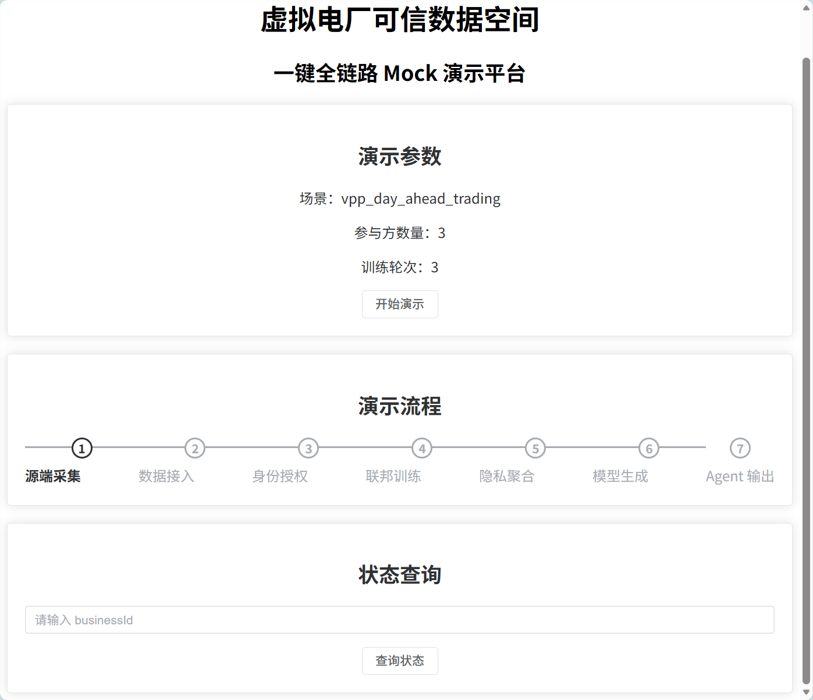
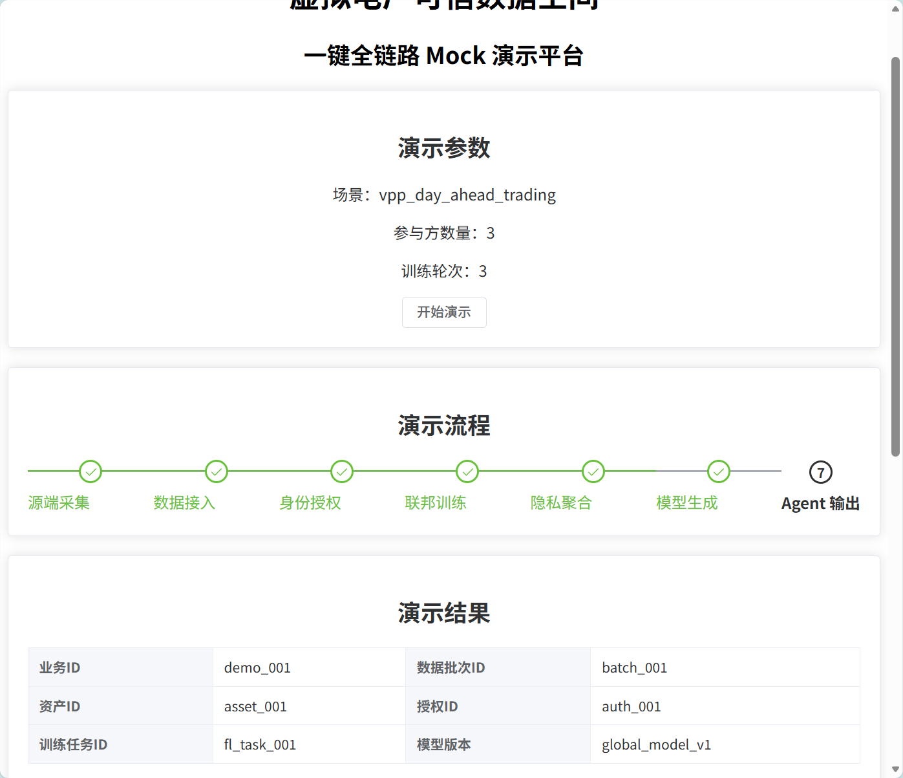
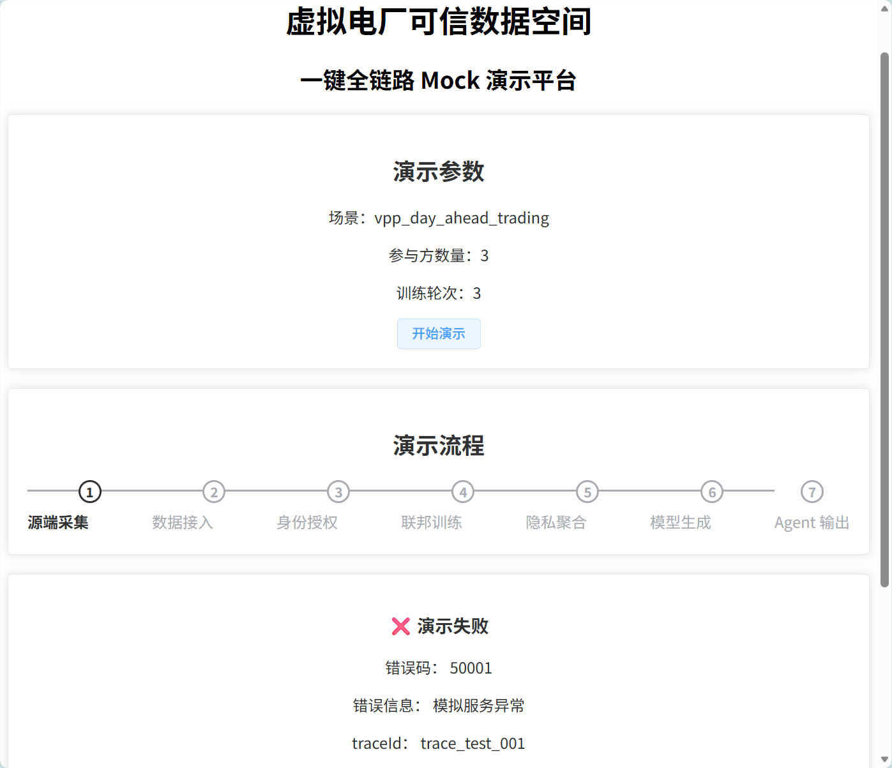

# Vue 3 + Vite

This template should help get you started developing with Vue 3 in Vite. The template uses Vue 3 `<script setup>` SFCs, check out the [script setup docs](https://v3.vuejs.org/api/sfc-script-setup.html#sfc-script-setup) to learn more.

Learn more about IDE Support for Vue in the [Vue Docs Scaling up Guide](https://vuejs.org/guide/scaling-up/tooling.html#ide-support).
# Web Dashboard 前端展示模块

## 一、模块简介

### 模块名称

Web Dashboard（前端展示模块）

### 模块路径

```
apps/web-dashboard
```

### 模块职责

Web Dashboard 是虚拟电厂可信数据空间（VPP Trusted Data Space）项目的前端展示模块，负责为用户提供统一的可视化操作界面。

根据系统整体架构设计，前端模块不直接访问各个业务服务，而是统一通过 API Gateway（接口网关）获取数据并进行页面展示。

本模块主要负责：

- 系统运行状态展示
- 系统流程可视化展示
- 演示（Demo）结果展示
- 模型训练结果展示
- 审计报告展示
- 服务健康状态展示
- 用户操作入口

---

# 二、模块边界

## 我负责的内容

本模块主要负责：

- 前端页面开发
- 页面布局设计
- 页面数据显示
- 用户交互操作
- 调用 API Gateway 获取业务数据
- 展示系统运行状态
- 展示模型训练结果
- 展示审计报告

## 不负责的内容

以下功能由后端模块负责，本模块不参与实现：

- 电表数据采集（meter-simulator）
- 数据接入（data-ingestion）
- 身份认证（identity-did）
- 联邦学习（federated-learning）
- 隐私计算（privacy-compute）
- 区块链存证（ledger-service）
- AI 智能分析（ai-agent）

前端模块只负责数据显示，不负责业务逻辑处理。

---

# 三、模块调用关系

## 被谁调用

用户通过浏览器访问 Web Dashboard 页面。

```
用户
 │
 ▼
Web Dashboard
```

## 调用谁

根据系统架构设计，Web Dashboard 不直接调用各业务模块，而是统一调用 API Gateway。

```
Web Dashboard
        │
        ▼
API Gateway
        │
        ├── meter-simulator
        ├── data-ingestion
        ├── identity-did
        ├── federated-learning
        ├── privacy-compute
        ├── ledger-service
        └── ai-agent
```

---

# 四、启动方式

目前仓库中 `apps/web-dashboard` 目录下暂无前端代码，仅保留模块目录结构。

因此，本模块启动方式将在前端项目初始化完成后补充。

---

# 五、接口说明

根据系统整体设计，Web Dashboard 主要调用 API Gateway 提供的接口。

目前涉及的主要接口如下：

| 方法 | 接口 | 功能 |
|------|------|------|
| POST | /api/v1/demo/run | 启动系统演示流程 |
| GET | /api/v1/demo/status/{businessId} | 查询演示运行状态 |
| GET | /health | 获取服务健康状态 |

说明：

前端页面只调用 API Gateway，不直接访问其他业务模块。

---

# 六、Mock 返回样例

启动演示接口成功返回示例：

```json
{
  "code": 0,
  "message": "ok",
  "data": {
    "businessId": "demo_001",
    "globalModelVersion": "global_model_v1",
    "auditReportId": "report_001"
  },
  "traceId": "trace_20260710_000001"
}
```

状态查询返回示例：

```json
{
  "code": 0,
  "message": "ok",
  "data": {
    "businessId": "demo_001",
    "status": "COMPLETED",
    "currentStage": "AGENT_COMPLETED"
  },
  "traceId": "trace_20260710_000002"
}
```

---

# 七、统一响应格式

项目所有接口统一采用以下响应格式：

成功：

```json
{
  "code": 0,
  "message": "ok",
  "data": {},
  "traceId": "trace_xxx"
}
```

失败：

```json
{
  "code": 40001,
  "message": "invalid request",
  "data": null,
  "traceId": "trace_xxx"
}
```

其中：

- code：业务状态码
- message：提示信息
- data：业务数据
- traceId：请求追踪编号

---
# 八、接口测试说明

目前 `apps/web-dashboard` 目录下尚未完成前端开发，因此暂未进行接口测试。

后续开发完成后，将通过 API Gateway（接口网关）调用项目提供的接口，并根据项目统一接口规范进行测试。

接口测试命令将在项目开发阶段补充。

---

# 九、技术说明

根据目前项目结构，本模块负责前端展示，不涉及后端业务实现。

当前目录尚未初始化前端项目，因此具体技术栈将在项目开发阶段确定。

计划实现内容包括：

- 前端页面开发
- 数据可视化展示
- 页面交互
- API 数据请求
- 演示结果展示

---

# 十、目录结构

```
apps/
└── web-dashboard/
    ├── .gitkeep
    └── README.md
```

---

# 十一、开发说明

开发过程中遵循以下原则：

1. 前端统一调用 API Gateway。
2. 不直接访问后端业务模块。
3. 页面仅负责数据展示，不处理业务逻辑。
4. 遵循项目统一接口规范。
5. 响应格式和错误码遵循公共协议文档。

---

# 十二、后续计划

后续将在本模块中逐步完成以下功能：

- 首页展示
- 系统运行流程展示
- 数据可视化页面
- 模型训练结果展示
- 审计报告展示
- 服务状态监控页面
- 用户交互界面

## 页面截图

### 初始页面




### 成功演示流程




### 失败演示流程

