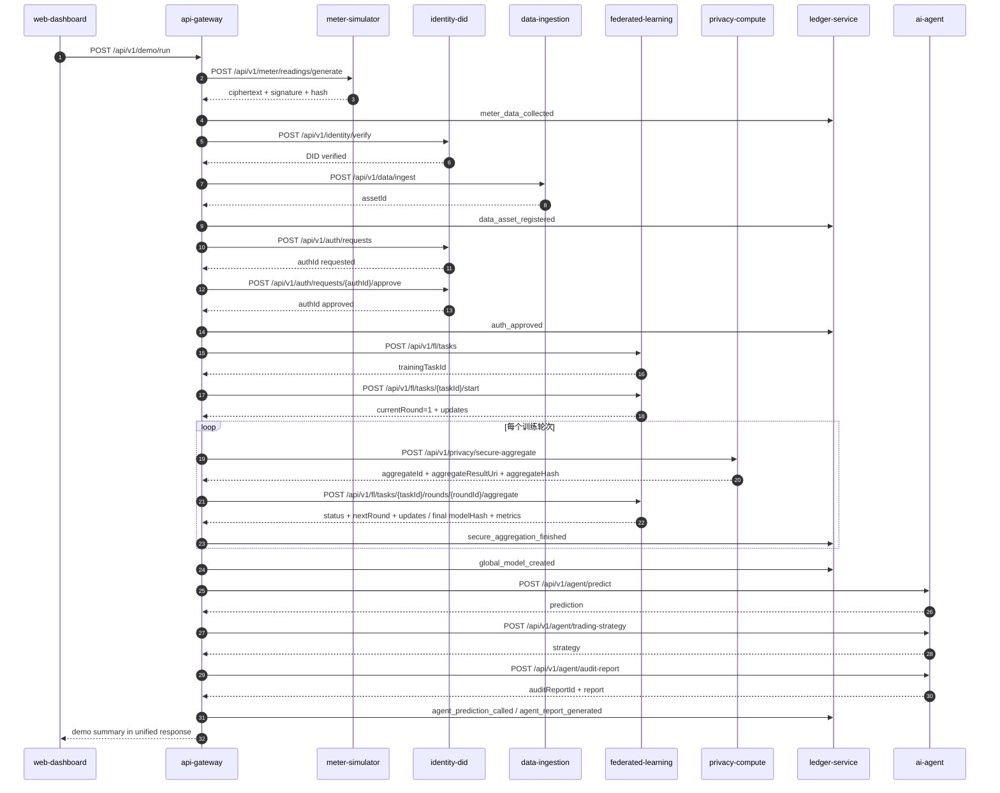

# 系统主流程与编排设计

> **文档职责**：本文档描述虚拟电厂可信数据空间从源端采集到 Agent 业务输出的跨模块主流程，明确模块调用顺序、数据边界、存证节点、状态转换和失败处理。它不定义单个接口的完整字段；接口路径和 Schema 以 `docs/api/openapi.md` 为准，统一响应和错误码以 `docs/api/response-and-errors.md` 为准。

## 1. 目标与边界

系统围绕“源端可信、数据不出域、联邦训练、参数保护、模型可追溯、Agent 可解释”形成闭环：

```text
源端可信采集 -> 安全传输与数据资产登记 -> DID 身份校验与授权
-> 本地训练与模型更新 -> 参数保护与安全聚合 -> FedAvg 全局模型
-> 预测、交易策略和审计报告 -> 全链路存证与前端展示
```

系统边界：

1. `apps/web-dashboard` 只访问 `services/api-gateway`。
2. `api-gateway` 负责编排，不实现加密、联邦学习、MPC 或 Agent 算法。
3. 业务模块通过固定 HTTP API 通信；所有模块提供 `GET /health`。
4. 第一周仅 `api-gateway` 负责跨模块编排和调用 `ledger-service`；其他业务模块不得直接调用 `ledger-service`。
5. 原始电表明文、主体本地训练数据和未保护模型参数不出主体本地数据域。
6. `ledger-service` 只保存事件、摘要、引用地址和哈希链，不保存原始明文数据。

## 2. 参与模块与责任

| 模块 | 主流程责任 | 数据边界 |
|---|---|---|
| `api-gateway` | 接收演示请求、编排顺序、汇总结果、触发存证 | 不持久化原始电表数据和模型参数 |
| `meter-simulator` | 生成电表数据、AES 加密、签名、SHA-256 摘要 | 明文只在源端处理 |
| `data-ingestion` | 验签、验哈希、登记数据资产 | 保存密文及元信息，不解密原始数据 |
| `identity-did` | 管理主体/设备 DID、授权申请和审批 | 保存身份、公钥与授权状态 |
| `federated-learning` | 本地训练、模型更新、FedAvg、版本与指标 | 每个客户端只读自己的本地分片 |
| `privacy-compute` | 加密演示、安全掩码、MPC 风格聚合、参数摘要 | 不拥有本地原始训练数据 |
| `ledger-service` | 关键事件存证、哈希链、按业务查询证据 | 只保存摘要、URI 和审计元数据 |
| `ai-agent` | 预测、交易策略、审计问答、报告生成 | 通过网关使用模型与证据链 |
| `web-dashboard` | 一键演示、状态展示、报告展示 | 不直连业务模块 |

## 3. 一键演示主流程

入口：`POST /api/v1/demo/run`。



## 4. 分阶段输入、输出和存证

### 4.1 源端采集与数据接入

1. 网关向 `meter-simulator` 请求指定数量和时间间隔的读数。
2. 源端为每条读数生成 `ciphertext`、`signature`、`hash`、`timestamp` 和批次 ID。
3. 网关记录 `meter_data_collected`，再向 `data-ingestion` 提交密文批次。
4. 数据接入服务验证签名和哈希，登记 `assetId`。
5. 网关记录 `data_asset_registered`，返回 `readingBatchId` 和 `assetId`。

原始数据边界：网关、数据接入、账本和 Agent 只能看到密文、摘要或元信息；明文只存在于源端或主体本地分片处理环节。

### 4.2 身份与授权

1. 网关调用 `POST /api/v1/identity/verify` 验证主体 DID 和设备 DID。
2. 验证成功后创建授权申请，绑定请求方、所有者、资产、用途和过期时间。
3. MVP 演示由网关调用审批接口完成审批；生产环境应由资源所有者或独立审批方触发。
4. 审批成功后记录 `auth_requested` 和 `auth_approved`，训练只能使用有效授权。

### 4.3 联邦学习与隐私计算

1. 网关创建训练任务并声明参与方、资产、目标、算法和轮次。
2. 联邦学习服务在单服务内模拟多个本地客户端，每个客户端只加载自己的数据分片。
3. `POST .../start` 固定返回第 1 轮 `currentRound: 1` 和完整 `updates[]`；每项包含 `participantDid`、`sampleCount`、`modelUpdateUri`、`updateHash`，不上传原始数据。
4. `POST .../rounds/{roundId}/updates` 的 `taskId`、`roundId` 只来自路径；请求体只包含 `participantDid`、`sampleCount`、`modelUpdateUri`、`updateHash`。
5. 每轮都由网关先把当前 `updates` 交给 `POST /api/v1/privacy/secure-aggregate`，再把返回的 `aggregateId`、`aggregateResultUri`、`aggregateHash` 交给 FL aggregate 执行 FedAvg。FL aggregate 的请求体只包含这三个字段；`taskId`、`roundId` 只来自路径。
6. 非最终轮 FL aggregate 返回 `status: running`、整数 `nextRound` 和下一轮完整 `updates[]`，网关据此继续下一轮 secure-aggregate 与 FL aggregate。
7. 最终轮 FL aggregate 返回 `status: completed`、`nextRound: null`、`updates: []`，并返回最终 `globalModelVersion`、`modelHash`、`metrics`（MAE、RMSE、MAPE）。
8. 网关将训练开始、参数提交、每轮安全聚合、最终模型生成和评估事件交给账本存证；业务服务不直接写账本。

### 4.4 Agent 业务输出

1. Agent 使用指定或最新 `global_model_vN` 生成预测。
2. Agent 根据预测、市场价格和场景生成交易策略建议。
3. 网关查询账本证据链后提供 `evidenceEventIds`；Agent 基于该证据引用生成审计问答或报告，不直接调用账本服务。
4. 网关记录 Agent 调用与报告生成事件，并将结果汇总给前端。

## 5. 状态与幂等

演示业务状态：

```text
CREATED -> COLLECTING -> DATA_REGISTERED -> AUTHORIZED -> TRAINING
-> MODEL_READY -> AGENT_COMPLETED -> COMPLETED
```

任意状态可进入 `FAILED`；失败任务可进入 `RETRYING` 后回到原状态或再次失败。`GET /api/v1/demo/status/{businessId}` 只查询状态，不重复执行流程。

`traceId`、幂等键和错误码的统一规则以 [公共响应与错误码](../api/response-and-errors.md) 为准；本流程不重复定义这些公共契约。

## 6. 失败处理与补偿

| 阶段 | 失败示例 | 网关处理 | 是否继续 |
|---|---|---|---|
| 源端采集 | 模拟器不可用、参数非法 | 标记 `FAILED`，按原 Key 重试 | 否 |
| 数据接入 | 验签失败、哈希不匹配 | 返回公共契约定义的校验错误，记录失败事件 | 否 |
| 授权 | DID 不存在、授权过期 | 返回公共契约定义的授权错误，不创建训练任务 | 否 |
| 本地训练 | 参与方未就绪、样本不足 | 保留任务状态，返回公共契约定义的训练错误 | 否 |
| 安全聚合 | 模式不支持、更新不足 | 当前轮次失败，可重试该轮次 | 否 |
| 存证 | 账本不可用 | 不宣称流程完成，返回公共契约定义的依赖错误 | 否 |
| Agent | 模型不存在、报告失败 | 单独标记 Agent 失败，允许重新调用 | 按产品策略 |

不删除已完成的采集、授权、训练轮次和模型版本；补偿动作使用同一 `businessId`、`traceId` 和错误码。

## 7. 最终汇总结果

成功时 `POST /api/v1/demo/run` 的 `data` 至少包含：

```json
{
  "businessId": "demo_001",
  "readingBatchId": "batch_001",
  "assetId": "asset_001",
  "authId": "auth_001",
  "trainingTaskId": "fl_task_001",
  "globalModelVersion": "global_model_v1",
  "metrics": { "mae": 2.31, "rmse": 3.72, "mape": 0.081 },
  "predictionId": "prediction_001",
  "strategyId": "strategy_001",
  "auditReportId": "report_001",
  "ledgerTxIds": ["tx_data_001", "tx_auth_001", "tx_model_001", "tx_agent_001"]
}
```

完整响应的公共包络还包含与响应头相同的 `traceId`。前端只依赖汇总结果、`traceId` 和状态查询，不依赖下游模块内部存储地址或算法实现。
